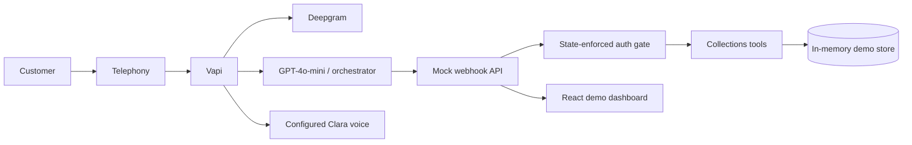

# Kapture Finance AI Collections Voicebot

## Overview

Maya is a respectful outbound collections voicebot for the fictional Kapture Finance lending company. This take-home demo shows how a Vapi-compatible assistant can authenticate a caller, keep debt data behind a backend-enforced gate, route common intents, call narrowly scoped backend tools, and finish with a disposition.

The dashboard is development-only and uses a deterministic in-memory account:

- Customer: Rahul Sharma
- Account: `ACC-88392`
- Loan type: Personal Loan
- Overdue EMI: ₹8,499
- Days past due: 12

The account is synthetic. Verification values are intentionally held inside the backend and are never returned to the dashboard.

## Architecture



The critical rule is enforced in the webhook server, not only in Maya's prompt:

`AUTH_PENDING → AUTHENTICATED` is allowed only when `verify_customer()` returns `{ "verified": true }`. While authentication is pending, account responses redact loan type, overdue amount, and days past due.

## Tech Stack

- React + Vite dashboard
- Node.js + Express 5 API server
- TypeScript
- OpenAPI-first contract with generated React Query hooks and Zod validators
- In-memory mock datastore for a fast, transparent take-home demo
- Vapi-compatible webhook payloads

## Project Structure

```text
artifacts/kapture-collections/
├── README.md
├── docs/
│   ├── HLD_Document.md
│   ├── HLD_Document.pdf
│   ├── architecture.mmd
│   └── System_Architecture.png
├── tests/
│   ├── test_cases.json
│   └── run_tests.mjs
├── vapi/
│   ├── assistant_config.example.json
│   ├── system_prompt.txt
│   └── tool_definitions.json
└── src/
    ├── App.tsx
    └── index.css

artifacts/api-server/src/routes/collections.ts
└── State machine, mock tools, webhook, demo actions, and safe read endpoints
```

## Local Setup

From the workspace root:

```bash
pnpm install
pnpm --filter @workspace/api-server run dev
```

In another terminal:

```bash
pnpm --filter @workspace/kapture-collections run dev
```

The managed preview starts both services with the configured workflows. Useful checks:

```bash
pnpm run typecheck
pnpm --filter @workspace/api-server run typecheck
pnpm --filter @workspace/kapture-collections run typecheck
```

There are no required environment variables for the mock demo. The shared server receives its port from the workflow.

## Webhook Setup

The local API webhook is available at:

- `POST /api/webhook` through the shared API namespace
- `POST /webhook` as a Vapi-friendly root-path alias

To connect a local instance to Vapi:

```text
localhost → ngrok → public HTTPS URL → Vapi server URL
```

Use the public URL ending in `/webhook`. The webhook accepts `message.type === "tool-calls"` and returns:

```json
{
  "results": [
    {
      "toolCallId": "tool-call-id",
      "result": "{\"verified\":true}"
    }
  ]
}
```

## Vapi Configuration

Recommended assistant configuration is captured in `vapi/assistant_config.example.json`:

- Model: GPT-4o-mini
- Temperature: `0.1`
- Transcriber: Deepgram Nova-2
- TTS: configure Clara only after the provider-specific voice is verified

GPT-4o-mini is appropriate for low-latency structured routing. Deepgram Nova-2 is a practical telephony transcription choice. A low temperature reduces unpredictable behavior in a compliance-sensitive flow. These are configuration intentions, not measured latency claims.

### Selected Voice

**Maya Voice: Clara — Warm, Professional and Helpful**

**Approved reference file:** `public/approved-voice/voice_preview_clara_-_warm,_professional_and_helpful_1786503064411.mp3`

Clara's warm, professional and helpful tone is appropriate for a collections agent because the conversation involves sensitive financial circumstances. The voice should communicate professionalism and confidence while avoiding an aggressive or intimidating tone.

The uploaded MP3 is preserved unchanged and is previewable in the dashboard. It is an **Approved Clara Voice Reference**, not a live TTS configuration. No Vapi/TTS connection or voice ID has been verified, so this demo intentionally does **not** fabricate a provider voice ID and does **not** silently substitute another voice.

To reproduce the exact Clara voice in live Vapi:

1. Upload or import the approved Clara reference into the chosen TTS provider.
2. Complete the provider's custom voice or voice-cloning approval flow if required.
3. Put the returned provider-specific voice ID in the Vapi assistant configuration.
4. Make a manual call and compare the result against the approved Clara MP3.
5. Keep the voice ID separate from the conversation logic.

The live voice status must remain **Reference only**, **Configured**, or **Verified live**. Use **Verified live** only after a real Vapi call has been placed and the configured voice has actually been heard.

## Tools

| Tool | Purpose | Auth rule |
| --- | --- | --- |
| `verify_customer` | Verifies account and transitions to `AUTHENTICATED` | The authoritative gate |
| `log_promise_to_pay` | Records date and amount | Authenticated only |
| `send_payment_link` | Prepares an SMS, WhatsApp, or both link | Authenticated only |
| `escalate_to_agent` | Routes dispute, hardship, callback, verification failure, or hostile calls | Narrow reason enum |
| `mark_disposition` | Finishes the call with a controlled status | Safe early-exit statuses are allowed before auth |

Unknown tools, malformed JSON, invalid account IDs, missing parameters, invalid channels, and failed verification return structured errors or failed tool results. Internal stack traces and verification values are not returned.

## State Machine

```text
INIT → AUTH_PENDING → AUTHENTICATED → NEGOTIATION → ACTION → CALL_ENDED
             │                ├───────────────→ ESCALATED → CALL_ENDED
             │                ├───────────────→ CALL_ENDED
             ├──────────────→ WRONG_PERSON → CALL_ENDED
             └──────────────→ VERIFICATION_FAILED → CALL_ENDED
```

The implementation keeps `currentState` and `authenticationStatus` in the backend session. UI buttons call preconfigured server scenarios; the hidden demo verification value is never sent from the browser.

## Demo Scenarios

Use **Reset session** before each scenario:

- **Successful PTP**: verifies, logs a promise for 2026-08-14, prepares an SMS payment link, and records `PTP_AGREED`.
- **Already Paid**: verifies and records `ALREADY_PAID` without arguing or fabricating a payment confirmation.
- **DNC**: records `DO_NOT_CALL` immediately and ends the call without negotiation.
- **Dispute**: verifies, escalates to the resolution queue, and records `DISPUTED`.
- **Hardship**: verifies, escalates to a human, and records `HARDSHIP_ESCALATED`.

The dashboard also includes wrong-person, hostile-caller, no-response, and verification actions for edge-case review.

## Testing

The required behavioral cases are listed in `tests/test_cases.json`. The highest-priority case is `TC-001 Authentication Guardrail`: a request to read the account before successful verification must return a redacted safe account view, and direct debt tools must fail until the backend verification tool succeeds.

Run the automated API checks while the API workflow is running:

```bash
node artifacts/kapture-collections/tests/run_tests.mjs
```

The script defaults to `http://127.0.0.1:8080`; set `API_BASE_URL` when the server is exposed elsewhere.

### Verified checks

- API server typecheck passes.
- OpenAPI code generation and shared library typecheck pass.
- The API test script covers TC-001, TC-012, TC-013, TC-014, and TC-015.
- Live Vapi transcription, TTS, and the exact Clara voice still require manual provider configuration and a real call.

## Business Scenario

Kapture Finance needs a respectful outbound assistant for synthetic overdue accounts. Maya must confirm the intended person, verify identity, explain the account only after verification, support a promise to pay, and stop or escalate when the customer disputes, reports hardship, asks for a callback, requests no further calls, or is not the intended customer.

## Debugging

- If the dashboard says the control room is offline, confirm the API workflow is running and check `GET /api/healthz`.
- If a webhook request is rejected, verify that the body is valid JSON, `message.type` is `tool-calls`, and every tool call has an `id`, `function.name`, and `function.arguments`.
- If account details are blank, reset the demo and complete `verify_customer` with a backend-known demo code through the scenario runner or webhook harness.

These are supported operating checks, not claims about an incident in production.

## Known Limitations

- The datastore is in memory and is reset when the API process restarts.
- Telephony, Vapi, STT, TTS, payment delivery, real identity verification, and callback scheduling are not connected.
- The Clara MP3 is a local approved reference only; Vapi requires a provider-supported Clara configuration.
- The synchronous mock reports zero latency/duration rather than measured provider performance.
- The dashboard is a reviewer control room, not a production agent console.

## Final Submission Checklist

- [x] Backend-enforced authentication and pre-auth debt redaction
- [x] Five strict Vapi tool definitions
- [x] Vapi-compatible `/webhook` and `/api/webhook` endpoints
- [x] Existing dashboard, scenarios, state trace, tool activity, dispositions, PTP records, and metrics preserved
- [x] Clara reference MP3 preserved and previewable
- [x] System prompt, assistant example, manual Vapi setup guide, HLD Markdown/PDF, and architecture Markdown/PNG included
- [x] TC-001 through TC-015 documented and API-level checks executable
- [ ] Manual Vapi account/provider setup and a real Clara call
- [ ] Live Vapi call and voice verification

## Future Improvements

- Persistent call and disposition storage
- Real identity verification provider
- Real payment-link delivery and payment gateway integration
- Callback scheduling
- Hindi/Hinglish evaluation set
- Automated conversation regression tests
- Production analytics and alerting
- Retry and provider-fallback strategy